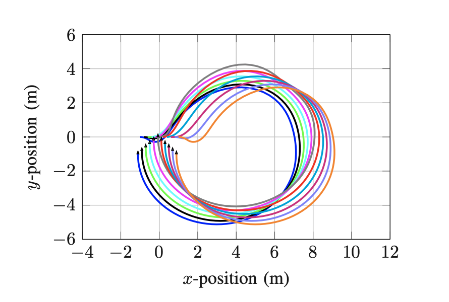
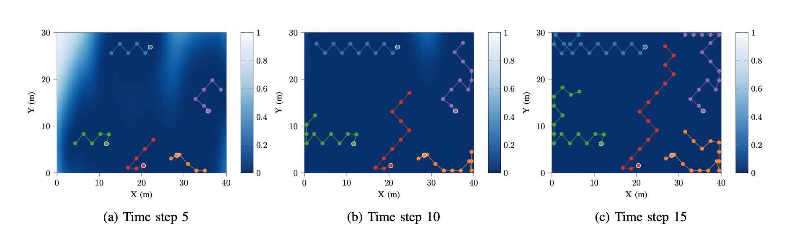

# Gaussian Process based  Model Predictive Control
<!--  -->

This project aims to enhance the performance of Model Predictive Control (MPC) for single dynamical systems or multi-agent systems by using Gaussian Processes (GPs) to learn system dynamics.

### Publications

* V.-A. Le and T. X. Nghiem, “Distributed Experiment Design and Control for Multi-agent Systems with Gaussian Processes”, submitted to 2021 IEEE Conference on Decision and Control (CDC).

* V.-A. Le and T. X. Nghiem, “A Receding Horizon Approach for Simultaneous Active Learning andControl using Gaussian Processes”, submitted to 2021 IEEE Conference on Control Technology and Applications (CCTA). [[arXiv preprint](https://arxiv.org/abs/2101.10351)]

* V.-A. Le and T. X. Nghiem, “Gaussian Process Based Distributed Model Predictive Control for Multi-agent Systems using Sequential Convex Programming and ADMM”, in 2020 IEEE Conference on Control Technology and Applications (CCTA), IEEE, 2020, pp. 31–36. [[link](https://ieeexplore.ieee.org/abstract/document/9206390)]

# Adaptive Sampling for Mobile Robotic Sensor Networks
<!--  -->

This project is a collaboration with Dr. Linh Nguyen from Australia Federation University. In this project, we develop efficient adaptive sampling strategies for a resource-constrained Mobile Robotic Sensor Network for monitoring a spatial phenomenon based on Gaussian Process.

### Publications

* V.-A. Le, L. Nguyen, and T. X. Nghiem, “ADMM-based Adaptive Sampling Strategy for Nonholonomic Mobile Robotic Sensor Networks”, submitted to IEEE Sensors Journal. [[arXiv preprint](https://arxiv.org/abs/2101.10500)]

* V.-A. Le, L. Nguyen, and T. X. Nghiem, “An Efficient Adaptive Sampling Approach for Mobile Robotic Sensor Networks using Proximal ADMM”, in 2021 American Control Conference (ACC), accepted.

<!-- This temporary [poster](../files/MRSN_poster.pdf) may be helpful to get the overall idea. -->

# Modeling and Control of Overhead Crane/Ship-mounted Crane

This research and experiment were conducted when I was an undergraduate research intern at School of Mechanical Engineering, Vietnam Maritime University. My duty includes designing anti-swing control algorithms for uncertain overhead crane/ship-mounted crane using sliding mode approach and Radial Basis Function (RBF) Neural Networks and implementing them on NI-MyRIO microcontroller.

### Publications

* V.-A. Le, X. H. Le, L. Nguyen, and X. M. Phan, “An efficient adaptive hierarchical sliding mode control strategy using neural networks for 3D overhead cranes”, International Journal of Automation andComputing, vol. 16, no. 5, pp. 614–627, 2019. [[link](https://www.sciencedirect.com/science/article/abs/pii/S0888327018302322) | [video](https://www.youtube.com/watch?v=ZlF37IZh89Q)]

* A. T. Le, M. C. Hoang, V. T. Pham, C. N. Luong, D. T. Vu, and V.-A. Le, “Adaptive neural network sliding mode control of shipboard container cranes considering actuator backlash”, Mechanical Systemsand Signal Processing, vol. 112, pp. 233–250, 2018. [[link](https://link.springer.com/article/10.1007/s11633-019-1174-y)]

* V.-A. Le, X. H. Le, D. T. Vu, V. T. Pham, A. T. Le, and M. C. Hoang, “Designing an adaptive con-troller for 3D overhead cranes using hierarchical sliding mode and neural network”, in2018 InternationalConference on System Science and Engineering (ICSSE), IEEE, 2018, pp. 1–6. [[link](https://ieeexplore.ieee.org/abstract/document/8520162)]
